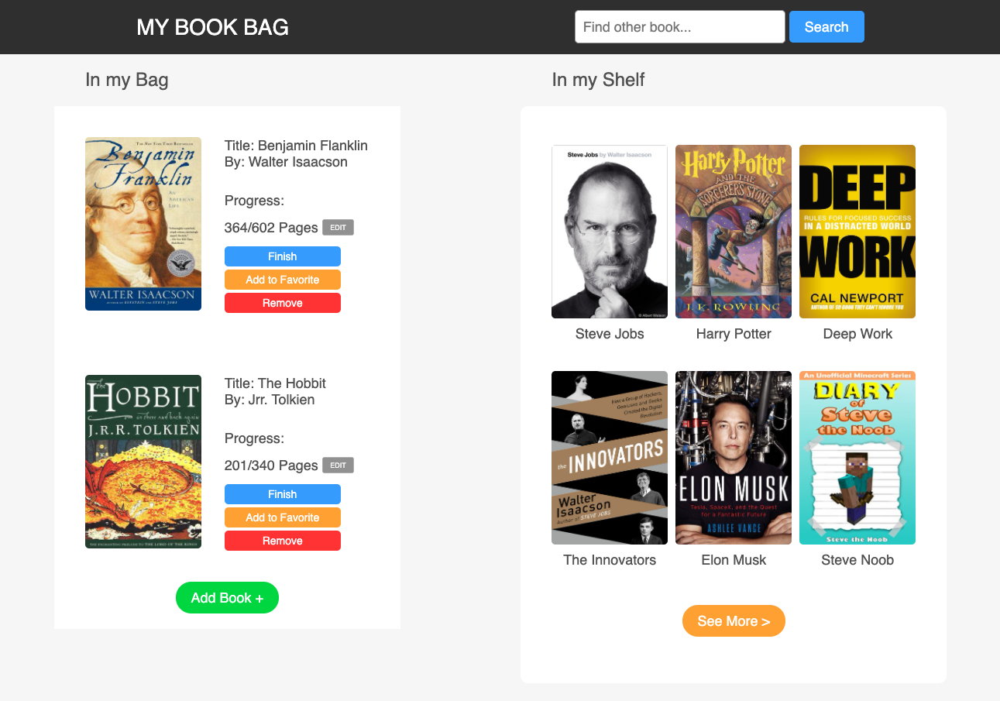
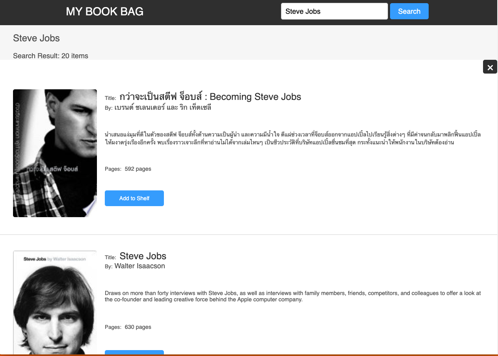
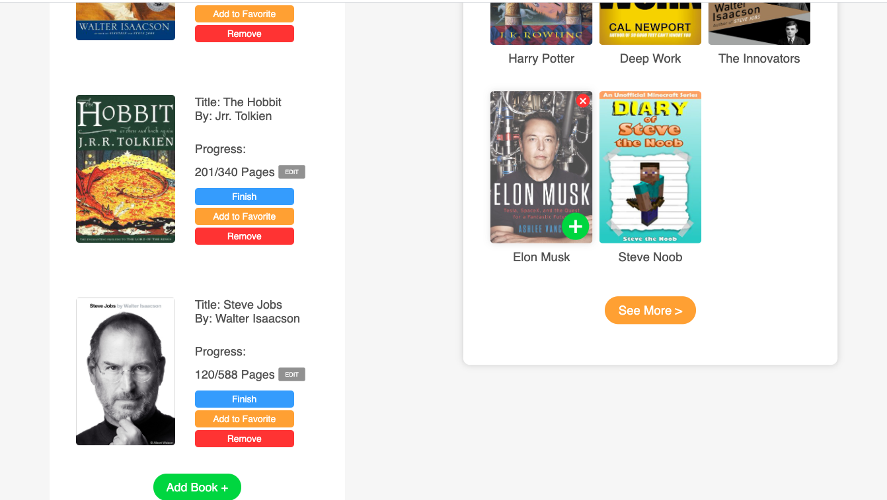

# What is My Book Bag Project

This project is the web application of books management that you can mangae your book in shelf, in your bag(book bag) and you can record your progress of each book. If you want to manage your new book you can add it from Search section from google book api. I hope you enjoy 

## How to start

This is the website of this project.
https://mybookbag.netlify.app/

### You can search your any book and add to your shelf

The books data are come from Google Book API (https://developers.google.com/books) 

### You can play around between your bag and shelf

You can add your book in shelf to your bag.
You can also remove your book in bag to your shelf.

----
Technology that I used : Reactjs 

